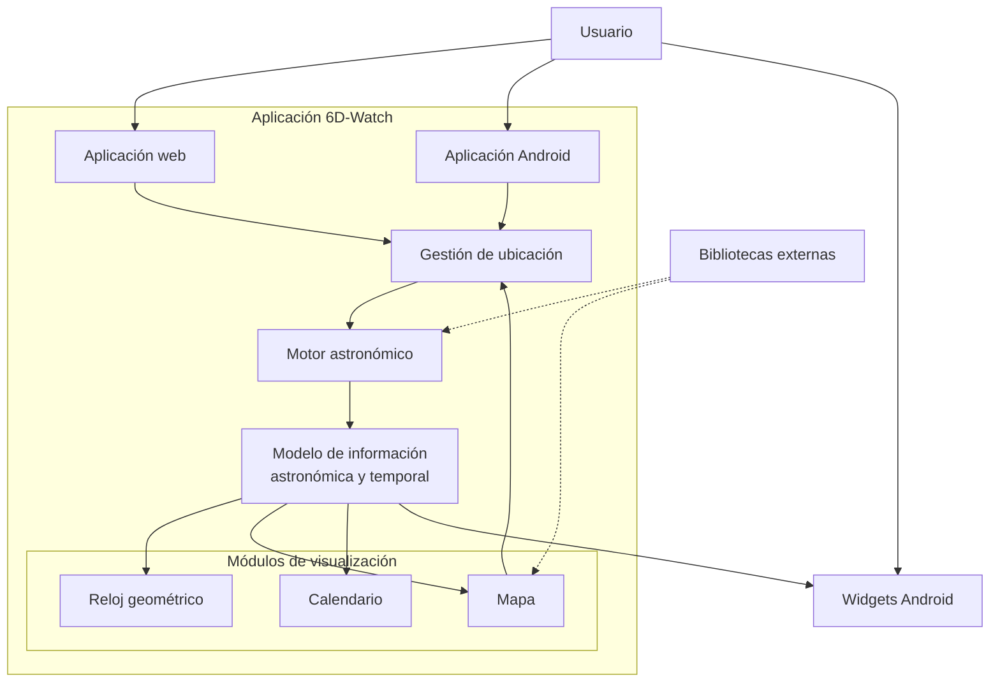

# Arquitectura conceptual de 6D-Watch

Propuesta para el Capítulo 3 (Solución propuesta) de una memoria de ingeniería. Describe la organización general del sistema, no su implementación técnica.

---

## 1. Justificación de la arquitectura

6D-Watch es un sistema de percepción temporal basado en ciclos astronómicos reales. Su valor no reside en una tecnología concreta de interfaz, sino en transformar la posición del observador y el instante actual en una representación coherente del tiempo natural.

Por ello, la arquitectura se organiza en torno a un **motor astronómico** que actúa como núcleo: recibe ubicación y referencia temporal, calcula eventos solares y lunares, y produce un **modelo de información** compartido. Sobre ese modelo se construyen las visualizaciones —reloj geométrico, mapa y calendario— y, en el entorno móvil, los widgets de acceso rápido.

La separación en capas responde a tres necesidades académicas y de diseño:

1. **Independencia del dominio.** El cálculo astronómico y temporal debe poder describirse sin acoplarlo a una interfaz concreta.
2. **Multiplataforma conceptual.** La misma solución se presenta al usuario como aplicación web, aplicación Android y widgets, sin que esas formas de entrega definan el núcleo del sistema.
3. **Flujo legible.** Un lector debe seguir, en un solo sentido, cómo la elección de un lugar conduce a información astronómica y, desde ella, a las representaciones visuales.

Esta arquitectura es deliberadamente abstracta. Las decisiones de frameworks, persistencia, librerías concretas y empaquetado móvil se reservan para el capítulo de implementación.

---

## 2. Capas

| Capa | Propósito |
|---|---|
| Interacción | Usuario y formas de acceso al sistema |
| Aplicación | Sistema 6D-Watch como conjunto funcional |
| Entrada espacial | Gestión de la ubicación del observador |
| Núcleo | Motor astronómico y temporal |
| Información | Modelo de datos astronómicos y temporales |
| Visualización | Representaciones del modelo al usuario |
| Extensión móvil | Widgets Android como proyección del mismo modelo |
| Soporte externo | Bibliotecas y servicios externos, tratados como un bloque |

---

## 3. Módulos

| Módulo | Función conceptual |
|---|---|
| Usuario | Persona que explora el tiempo astronómico en un lugar |
| Aplicación 6D-Watch | Sistema completo que integra cálculo y representación |
| Aplicación web | Acceso completo desde navegador |
| Aplicación Android | Acceso completo empaquetado para dispositivo móvil |
| Gestión de ubicación | Determina el punto de observación sobre la Tierra |
| Motor astronómico | Núcleo que calcula ciclos solares, lunares y tiempo geométrico |
| Modelo de información | Conjunto de resultados astronómicos y temporales compartidos |
| Reloj geométrico | Representación circular del tiempo natural |
| Mapa | Exploración espacial y selección de lugar |
| Calendario | Exploración temporal por días y ciclos |
| Widgets Android | Vista resumida del modelo en la pantalla de inicio |
| Bibliotecas externas | Soporte de cálculo, cartografía y tiempo civil |

---

## 4. Diagrama Mermaid

---

## 5. Explicación de cada bloque

**Usuario.** Interactúa con el sistema para observar el tiempo natural asociado a un lugar y a un momento. Puede hacerlo desde la web, la app Android o un widget.

**Aplicación 6D-Watch.** Contenedor conceptual de la solución: integra entrada espacial, cálculo astronómico y representaciones visuales bajo un mismo propósito.

**Aplicación web / Aplicación Android.** Dos formas de entrega de la misma experiencia completa. No alteran el núcleo del sistema; solo el medio de acceso.

**Gestión de ubicación.** Define el punto de observación. Es la entrada principal del dominio: sin posición geográfica no hay ciclo solar local coherente.

**Motor astronómico.** Núcleo de la solución. A partir de ubicación y tiempo produce eventos solares y lunares, y la hora geométrica que estructura la percepción temporal del sistema.

**Modelo de información astronómica y temporal.** Resultado estabilizado del motor: el conocimiento compartido que alimenta todas las visualizaciones y los widgets, sin acoplarlos entre sí.

**Reloj geométrico.** Traduce el modelo a una lectura circular del día natural, centrada en amanecer, mediodía, atardecer y medianoche geométrica.

**Mapa.** Permite explorar y seleccionar ubicaciones, y situar el fenómeno astronómico en el espacio terrestre.

**Calendario.** Permite recorrer el tiempo por días, mostrando la variación astronómica a lo largo del ciclo anual.

**Widgets Android.** Extienden el modelo fuera de la aplicación abierta, ofreciendo una lectura resumida del estado temporal en el dispositivo.

**Bibliotecas externas.** Apoyan cálculos, cartografía y referencia temporal civil. Se agrupan en un solo bloque para no desplazar el foco desde la solución hacia las herramientas.

---

## 6. Título y pie de figura

**Título**

> Figura X. Arquitectura conceptual de 6D-Watch: del observador al modelo astronómico-temporal y sus representaciones.

**Pie**

> El usuario accede al sistema por la aplicación web, la aplicación Android o los widgets. La gestión de ubicación alimenta el motor astronómico, que produce un modelo de información compartido. Sobre ese modelo se construyen el reloj geométrico, el mapa y el calendario; los widgets consumen la misma información de forma resumida. Las bibliotecas externas sostienen el cálculo y la cartografía, sin definir la estructura de la solución.

---

## 7. Revisión crítica

**¿Este diagrama explica la solución del sistema o únicamente el código?**

Explica la **solución del sistema**. El protagonista es 6D-Watch como organizador de un flujo de conocimiento —ubicación → cálculo astronómico → modelo → visualización—, no el detalle de frameworks, componentes ni mecanismos internos de ejecución. Las tecnologías de entrega (web, Android, widgets) aparecen solo como formas de acceso, y las bibliotecas se agrupan en un bloque de soporte.
