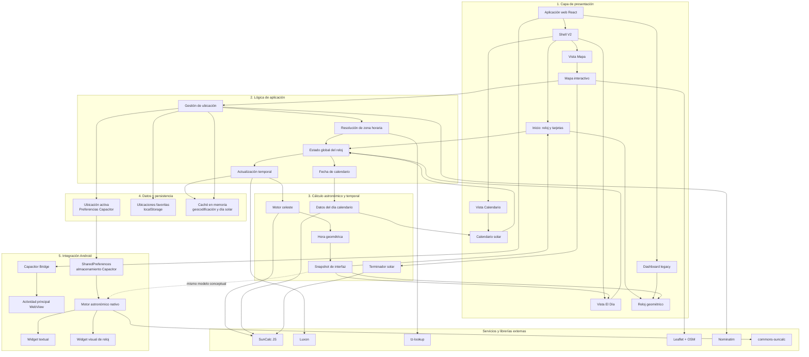
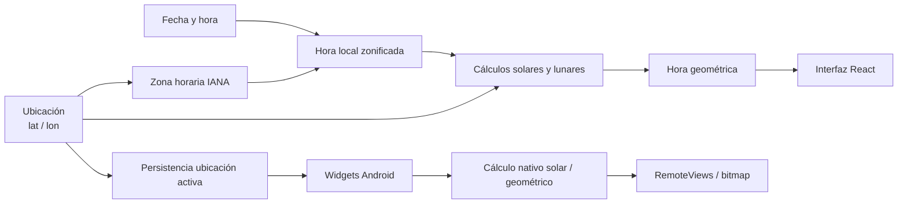

# Arquitectura actual de 6D-Watch

Documento descriptivo de la arquitectura **realmente implementada** en el repositorio, orientado a su inclusión en una memoria académica. No describe propuestas futuras ni dependencias instaladas pero no cableadas (por ejemplo Three.js).

---

## 1. Módulos reales encontrados

| Módulo conceptual | Rol |
|---|---|
| Aplicación web React (Vite) | Entrada principal; interfaz y navegación |
| Shell V2 | Layout, sidebar e inicio (reloj + tarjetas) |
| Vistas V2 | El Día, Calendario Solar, Mapa |
| Dashboard legacy | Ruta alternativa con reloj analógico y arco solar |
| Estado global del reloj | Ubicación, fecha de calendario, snapshot temporal |
| Gestión de ubicación | Selección en mapa, favoritos, ubicación activa |
| Resolución de zona horaria | Derivación IANA offline a partir de latitud/longitud |
| Motor celeste | Eventos solares, datos lunares, ventanas día/noche (incl. polares) |
| Hora geométrica | Normalización del ciclo solar a 24 unidades |
| Snapshot de interfaz | Empaquetado de datos listos para UI |
| Reloj geométrico | Representación SVG animada (V2) y dial analógico (legacy) |
| Mapa interactivo | Leaflet, marcador, terminador solar |
| Calendario solar | Día seleccionado e información astronómica del día |
| Persistencia local | Preferencias Capacitor + `localStorage` + cachés en memoria |
| Empaquetado Android | Capacitor Bridge sobre el build web |
| Widgets Android | Widget de texto y widget visual de reloj |
| Motor astronómico nativo (widgets) | Cálculo paralelo en Android (SunCalc + hora geométrica) |
| Servicios externos | Nominatim (geocodificación inversa), teselas OpenStreetMap |

---

## 2. Relaciones principales

1. La **ubicación** (latitud/longitud) determina la **zona horaria** y alimenta el motor astronómico.
2. La **fecha/hora local** (Luxon en la zona resuelta) dispara el recálculo periódico del snapshot.
3. El motor celeste produce amanecer, atardecer, mediodía, datos lunares y ventanas día/noche.
4. Sobre esas ventanas se calcula la **hora geométrica**, que alimenta el reloj, las tarjetas y el fondo dinámico.
5. El **calendario** usa la misma ubicación y zona, pero con una fecha seleccionada independiente del “ahora”.
6. El **mapa** escribe ubicación hacia el estado global y lee terminador/posición para overlays.
7. La **ubicación activa** se persiste en Preferencias Capacitor; las **favoritas**, en `localStorage`.
8. Los **widgets Android** leen esa ubicación persistida y recalculan con un motor nativo equivalente (no reutilizan el runtime React).

---

## 3. Diferencias respecto a la arquitectura propuesta inicialmente

| Aspecto propuesto / intermedio | Arquitectura final implementada |
|---|---|
| UI monolítica en JavaScript vanilla (`main.js` + DOM) | UI React con router; entrada `main.jsx`; el vanilla queda fuera del flujo |
| Zona horaria fija `"UTC"` y plan de APIs (GeoNames / TimeZoneDB) | Zona horaria local vía `tz-lookup` offline; sin API de timezone |
| Un único dashboard | Shell V2 multipágina (Inicio, Día, Calendario, Mapa) + ruta legacy |
| Visualización 3D / globo (pospuesta o dependencias instaladas) | No integrada; mapa 2D con Leaflet |
| Calendario fuera del flujo React (estado temprano de migración) | Calendario integrado en la vista V2 y en el estado global |
| Cálculo solo en el cliente web | Cálculo web (SunCalc JS) **y** cálculo nativo paralelo en widgets Android |
| Sin capa móvil nativa | Empaquetado Capacitor + dos AppWidgets clásicos |

---

## 4. Diagrama Mermaid

### Flujo de información destacado

---

## 5. Explicación breve de cada bloque

### Capa de presentación
Interfaz React servida por Vite. La experiencia principal es la shell V2 (Inicio con reloj geométrico SVG y tarjetas, más las vistas El Día, Calendario y Mapa). Existe un dashboard legacy como ruta alternativa. El mapa y el calendario son componentes de presentación que leen y escriben el estado compartido.

### Lógica de aplicación
Un único contexto React concentra ubicación, nombre geocodificado, favoritos, instante actual, snapshot y fecha de calendario. Al elegir un punto, se resuelve la zona horaria, se persiste la ubicación activa y se reinicia el día solar en caché. Un tick periódico mantiene la hora local y regenera el snapshot.

### Cálculo astronómico y temporal
A partir de coordenadas, zona y instante, el motor celeste obtiene eventos solares y lunares (SunCalc) y ventanas día/noche (con manejo de casos polares). La hora geométrica normaliza ese ciclo a 24 unidades. El snapshot traduce esos valores a cadenas y magnitudes para la UI. El calendario y el terminador del mapa reutilizan la misma base astronómica con entradas propias (fecha seleccionada u hora de overlay).

### Datos y persistencia
No hay backend propio. La ubicación activa vive en Preferencias Capacitor (compartida con Android); las favoritas, en `localStorage`. Hay caché en memoria para geocodificación inversa y para no recalcular el día solar cada segundo. Nominatim y las teselas OSM son los únicos servicios de red habituales.

### Integración Android
Capacitor empaqueta el build web en una WebView. En paralelo, dos AppWidgets leen la ubicación activa desde el almacenamiento de Capacitor, calculan con un motor nativo (commons-suncalc + hora geométrica) y actualizan vistas remotas o un bitmap del reloj. El modelo conceptual es el mismo que en web; la implementación del widget es nativa e independiente del runtime React.

---

## 6. Título y pie de figura propuestos

**Título**

> Figura X. Arquitectura general de 6D-Watch: capas de presentación, lógica, cálculo astronómico-temporal, persistencia e integración Android.

**Pie**

> El diagrama muestra únicamente los módulos implementados. La ubicación y la zona horaria alimentan el motor celeste y la hora geométrica, que se consumen en la interfaz React; la ubicación activa persistida habilita un cálculo nativo equivalente en los widgets Android. Las flechas discontinuas indican equivalencia conceptual, no una llamada en tiempo de ejecución entre el snapshot web y el motor nativo.

---

*Archivo generado a partir del código del repositorio 6D-Watch. No modifica la aplicación.*
