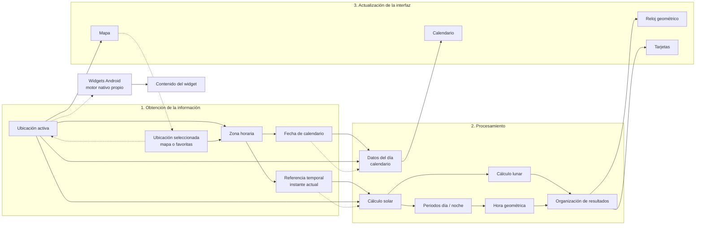

# Flujo general de funcionamiento de 6D-Watch

Documento de apoyo al Capítulo 3 (Solución propuesta). Describe únicamente el flujo comprobado en el código. La sección conceptual está redactada sin nombres de implementación; la verificación técnica los recoge al final.

---

## 1. Resumen del flujo real

6D-Watch parte de dos entradas: una ubicación geográfica activa y una referencia temporal. La ubicación determina la zona horaria local. Con ambas, el sistema calcula los eventos solares del entorno temporal, los datos lunares, la ventana día/noche (incluido el tratamiento de casos sin amanecer o atardecer del día civil) y, a partir de esa ventana, la hora geométrica. Los resultados se formatean y se entregan a la interfaz en tiempo real.

Existe un segundo recorrido, paralelo e independiente del reloj en vivo: la consulta de un día del calendario. En ese recorrido se recalculan datos solares y lunares para la fecha seleccionada, pero no se calcula la hora geométrica ni se sustituye el estado del reloj. Los widgets Android no consumen el estado de la aplicación abierta: leen la ubicación activa persistida y ejecutan un cálculo nativo propio.

---

## 2. Obtención de la información

### Origen y recuperación de la ubicación activa

Al iniciar, el sistema adopta por defecto una ubicación de referencia (Santiago). En paralelo, intenta recuperar la ubicación activa persistida. Si existe y es válida (coordenadas numéricas y zona horaria), sustituye el valor por defecto, reinicia la fecha del calendario al día local correspondiente y, si hay nombre almacenado, lo usa directamente. Si no hay ubicación persistida, mantiene la de referencia y solicita el nombre legible de ese punto.

### Selección mediante mapa o ubicaciones guardadas

El usuario puede cambiar la ubicación activa de dos modos implementados:

1. **Selección en el mapa:** un clic entrega latitud y longitud.
2. **Selección de una ubicación guardada:** se toman las coordenadas de la lista de favoritas.

En ambos casos se aplica el mismo procedimiento de activación: se resuelve la zona horaria, se actualiza la ubicación activa, se fuerza el día del calendario al “hoy” de esa zona y se resuelve el nombre del lugar. Las favoritas se leen y escriben en almacenamiento local del navegador; no sustituyen por sí solas a la ubicación activa hasta que el usuario las selecciona.

### Resolución de zona horaria

La zona horaria se obtiene de forma local a partir de las coordenadas, sin consultar un servicio de timezone en red. El resultado es un identificador de zona IANA asociado al punto seleccionado. Ese identificador acompaña a la ubicación en todo el flujo posterior.

### Instante actual

El sistema obtiene el instante civil del dispositivo y lo interpreta en la zona horaria de la ubicación activa. Esa referencia se renueva de forma periódica mientras la aplicación permanece abierta, de modo que el reloj en vivo avance con el tiempo real.

### Fecha seleccionada en el calendario

La fecha del calendario es un estado distinto del instante actual. Se inicializa al día local de la ubicación y puede cambiar cuando el usuario navega el mes o elige un día. Un cambio de ubicación activa también la reinicia al día local nuevo. La consulta del calendario usa esa fecha —normalizada al mediodía local— junto con las coordenadas y la zona activa.

### Nombre del lugar

El nombre visible no interviene en los cálculos astronómicos. Se obtiene, en este orden de prioridad: nombre de una favorita coincidente; geocodificación inversa por red; o etiqueta de respaldo (océano o etiqueta derivada de la zona). Solo cuando el nombre queda resuelto (no nulo) se persiste la ubicación activa completa.

---

## 3. Procesamiento

Orden real del recorrido en tiempo real, tras disponer de ubicación, zona e instante local:

### 3.1 Preparación de la fecha y hora local

Se fija el instante en la zona de la ubicación. A partir de él se definen el día civil local, el día anterior y el siguiente. Los horarios solares de cada día se solicitan tomando el mediodía local como ancla, para que “hoy / ayer / mañana” coincidan con el día civil de esa zona.

### 3.2 Cálculos solares del entorno diario

Se obtienen los tiempos solares del día actual, del anterior y del siguiente (amanecer, atardecer y demás marcas disponibles). Con el instante de referencia y las coordenadas se calculan, además, el mediodía solar, la elevación máxima y los intervalos de luz especial (hora dorada y hora azul, según las marcas que entrega la librería astronómica).

### 3.3 Cálculo lunar

Sobre el mismo instante y coordenadas se obtienen fase, iluminación, salida y puesta de la Luna. La salida o la puesta pueden no existir para ese día; en ese caso el resultado queda vacío y la interfaz muestra un marcador de ausencia.

### 3.4 Determinación de los periodos diurno y nocturno

Se evalúa si el Sol está sobre el horizonte en el instante actual. Con esa condición se construye una ventana solar:

- si el Sol está arriba, la ventana va del amanecer previo al atardecer siguiente;
- si está abajo, del atardecer previo al amanecer siguiente.

Cuando el día civil no tiene amanecer o atardecer, o cuando la ventana supera las 24 horas, el sistema marca el caso como polar y busca eventos en un rango extendido de días. Esa ventana es la base preferente para la hora geométrica y para las duraciones en condiciones extremas.

### 3.5 Cálculo de la hora geométrica

Si la ventana solar está completa:

- en periodo diurno, el progreso de la ventana se mapea al intervalo geométrico 6–18;
- en periodo nocturno, al intervalo 18–6 (con normalización modular a 24 horas).

Si la ventana no está disponible, se usa el cálculo clásico día/noche con amanecer del día, atardecer activo y próximo amanecer. Si faltan esos extremos, la hora geométrica queda indeterminada y se presenta como valor no disponible.

### 3.6 Duraciones e información derivada

A continuación se calculan la duración del día y de la noche (con fórmulas distintas en caso polar) y, si aplica, el texto de estado polar (tiempo hasta la próxima transición). También se formatea la diferencia conceptual entre hora civil y geométrica cuando la interfaz la solicita.

### 3.7 Organización de resultados para la presentación

Los valores crudos se transforman en un paquete listo para interfaz: hora civil, hora geométrica, fecha larga, amanecer/atardecer, mediodía, elevación, duraciones, fase lunar, intervalos de luz especial y datos crudos para animaciones (ángulo geométrico, fase lunar numérica, marcas solares). Ese paquete es la entrada común del reloj en vivo y de las tarjetas asociadas.

### 3.8 Procesamiento del calendario (rama paralela)

Al cambiar la fecha seleccionada o la ubicación, se recalcula un día de calendario independiente: estación por mes y hemisferio, eventos solares y lunares del mediodía de ese día, duraciones día/noche y periodos de luz especial. **No** se calcula hora geométrica en esta rama. El resultado alimenta solo la información del día seleccionado.

---

## 4. Actualización de la interfaz

### Qué recibe resultados

| Ámbito de interfaz | Fuente principal | Contenido típico |
|---|---|---|
| Reloj geométrico (vista de inicio) | Resultados del procesamiento en tiempo real | Ángulo/hora geométrica, fase lunar, hora civil auxiliar |
| Tarjetas de inicio y de “El Día” | Mismo paquete en tiempo real | Hora civil/geométrica, amanecer/atardecer, duraciones, luna, hora dorada/azul, datos solares |
| Dial de progreso del día | Derivado del paquete en tiempo real | Progreso entre amanecer y atardecer del día civil |
| Mapa | Ubicación activa + cálculo cartográfico propio del terminador | Marcador, bandas día/noche; el clic escribe nueva ubicación |
| Calendario e información del día | Rama de fecha seleccionada | Datos del día elegido, estación |
| Comparación de ubicaciones | Cálculo propio por cada favorita | Snapshot astronómico independiente por ubicación guardada |
| Dashboard legacy | Mismo paquete en tiempo real (+ fondo dinámico) | Misma información, disposición distinta |

Algunos paneles de las vistas “El Día”, “Calendario” y “Mapa” existen como placeholders y no muestran datos calculados.

### Cuándo se actualiza

1. **Carga inicial:** se monta con la ubicación por defecto; si la persistencia restaura otra ubicación, se recalcula todo el flujo en vivo y el día de calendario.
2. **Transcurso del tiempo:** cada segundo se renueva el instante local y se regenera el paquete de presentación. Los eventos solares/lunares del día se reutilizan mientras no cambie el día civil local ni la ubicación.
3. **Cambio de ubicación:** se resuelve zona, se invalida la caché del día solar, se reinicia el calendario al día local y se recalcula el flujo completo. El nombre se resuelve de forma asíncrona.
4. **Cambio de fecha de calendario:** solo recalcula la rama del día seleccionado; no altera el reloj en vivo ni la hora geométrica mostrada en inicio.
5. **Persistencia hacia Android:** cuando ya se cargó la ubicación activa y el nombre no es nulo, se escribe la ubicación activa en el almacén compartido. Eso no dispara por sí solo un recálculo en la interfaz web.

### Cachés e invalidación

| Caché | Contenido | Reutilización | Invalidación |
|---|---|---|---|
| Día solar en memoria | Eventos solares/lunares y ventana del día activo | Mientras coincidan zona, coordenadas (aprox. 4 decimales) y fecha civil local | Cambio de ubicación, zona o día local |
| Nombres geocodificados en memoria | Nombre por coordenadas redondeadas (~1 km) | Evita repetir la consulta de red | No hay invalidación explícita; vive mientras dure la sesión |
| Favoritas en almacenamiento local | Lista de ubicaciones guardadas | Carga al inicio; se reescribe al añadir/eliminar | Al modificar la lista |
| Ubicación activa compartida | Coordenadas, zona y nombre | Recuperación al inicio; lectura por widgets | Al cambiar ubicación y disponer de nombre |
| Bitmap / estado de pintura del widget visual | Última imagen entregada | Reentrega inmediata ante actualizaciones del sistema | Nuevo render encolado por el trabajador del widget |

### Qué fuerza un nuevo cálculo astronómico completo (tiempo real)

- Carga con ubicación distinta a la ya cacheada.
- Cambio de latitud/longitud o de zona.
- Cruce de medianoche local (cambio de clave de día).
- En comparación de ubicaciones: cada favorita evaluada dispara su propio cálculo, fuera de la caché del reloj principal.

El avance segundo a segundo **no** recalcula de nuevo todos los eventos del día si la clave diaria se mantiene; solo reevalúa hora geométrica, textos dependientes del instante y derivados.

---

## 5. Flujo de los widgets Android

Los widgets siguen un flujo separado:

1. **Obtención de ubicación.** Leen primero la ubicación activa del almacén compartido con la aplicación. Si no hay datos válidos, intentan la última ubicación conocida del dispositivo (si hay permisos). Si tampoco, usan la ubicación de referencia (Santiago).
2. **Cálculo.** Un motor nativo obtiene el instante actual en la zona de esa ubicación, calcula amanecer/atardecer del día civil y la hora geométrica con la misma convención 6–18–0. Si faltan eventos solares necesarios, el estado se marca como no disponible. Este motor **no** reproduce la ventana polar extendida ni el paquete lunar completo de la aplicación principal.
3. **Actualización de contenido.**
   - Widget textual: escribe hora geométrica, hora civil, ubicación y estado día/noche en la vista remota. Se refresca periódicamente (aprox. cada 5 minutos) y por acción manual.
   - Widget visual: resuelve ubicación y estado geométrico, renderiza una imagen del reloj y la entrega al widget. También usa refresco periódico/manual y puede reutilizar la última imagen válida.
4. **Separación respecto a la aplicación principal.** Los widgets no leen el estado en memoria de la interfaz ni el paquete de resultados generado en la sesión web. Solo comparten la ubicación persistida. Por eso pueden mostrar valores con distinta cadencia, distinta cobertura de casos polares y, si nunca se abrió la app con un nombre resuelto, una ubicación de respaldo distinta a la que el usuario ve en pantalla.

---

## 6. Diagrama Mermaid conceptual

---

## 7. Verificación técnica

| Etapa conceptual | Archivo o archivos relacionados | Función, componente o clase relevante | Evidencia encontrada | Observaciones o posibles dudas |
|---|---|---|---|---|
| Carga inicial / ubicación por defecto | `src/context/WatchContext.jsx` | `INITIAL_LOCATION`, estado inicial de `location` | Santiago fijo al montar el proveedor | — |
| Recuperación de ubicación activa | `WatchContext.jsx` | `Preferences.get` con clave `6dw-active-location` | Restaura lat/lon/timezone/name; valida finitud | Si el JSON es inválido, se ignora y queda el default |
| Persistencia compartida con Android | `WatchContext.jsx`; `WidgetLocationResolver.java` | `Preferences.set`; lectura de `CapacitorStorage` | Misma clave `6dw-active-location` | La escritura web exige `locationName != null` |
| Selección por mapa | `Map.jsx` / `map.js`; páginas Mapa e Inicio | callback `onSelectLocation` | Clic → lat/lon → activación | — |
| Selección por favoritas | `LocationManager.jsx`; `WatchContext.jsx` | `onSelectLocation`, `savedLocations` | Favoritas en `localStorage` (`6dw-saved-locations`) | Defaults embebidos si no hay lista guardada |
| Zona horaria | `WatchContext.jsx` | `tzLookup(lat, lon)` | Offline, al seleccionar o al restaurar sin timezone | Widgets: si falta timezone usan zona del dispositivo |
| Instante actual | `src/hooks/useClockData.js` | `DateTime.now().setZone` + `setInterval` 1000 ms | Tick cada segundo; se reinicia al cambiar zona | — |
| Caché del día solar | `useClockData.js` | `dailyRef` + `dayKey` | Clave: timezone\|lat\|lon\|yyyy-MM-dd | Se recalcula al cambiar cualquiera de esos campos |
| Cálculo solar / lunar / ventana | `src/core/celestial.js`, `src/astronomy.js` | `computeDailyCelestial`, `getSolarEvents`, `getLunarData` | Orden: times día → solarEvents → lunar → solarWindow | `getSolarEvents`/`getLunarData` reciben el `now` actual, no el mediodía |
| Hora geométrica y formateo UI | `src/core/clockSnapshot.js`, `geometricTime.js` | `computeClockSnapshot`, `computeGeometricHour` | Ventana polar preferente; si no, fórmula clásica | Duraciones se calculan después de la hora geométrica |
| Fecha de calendario | `WatchContext.jsx`, `calendar.js` | `selectedDate`, `getCalendarDay` | Mediodía local; sin hora geométrica | Independiente del tick de 1 s |
| Interfaz inicio / día | `WatchUiHome.jsx`, `DashboardCards.jsx`, `DiaPage.jsx`, `V2GeometricClock.jsx` | consumo de `useWatch().snapshot` | Tarjetas y reloj leen el paquete compartido | `DiaPage` tiene varios placeholders sin datos |
| Mapa / terminador | `Map.jsx`, `solarTerminatorOverlay.js` | overlay con SunCalc + leaflet.terminator | Cálculo cartográfico propio, no usa el snapshot | Actualización visual del terminador acoplada al mapa |
| Comparación de ubicaciones | `locationComparison.js` | `computeDailyCelestial` + `computeClockSnapshot` por favorita | Duplica el motor fuera de `useClockData` | Puede divergir temporalmente del reloj principal |
| Widget textual | `D6WatchWidgetProvider.java`, `GeometricTimeCalculator.java` | `calculateNow`, refresh ~5 min | RemoteViews con civil/geométrica/estado | Sin ventana polar extendida; `unavailable` si faltan times |
| Widget visual | `GeometricClockWidgetProvider.java`, `GeometricClockWidgetUpdateWorker.java` | mismo resolver + calculator + render bitmap | Reentrega caché de imagen; WorkManager para render | Path principal nativo SVG→bitmap |
| Geocodificación | `geocode.js` | `geocodeReverse`, `nameCache` | Nominatim + caché ~1 km | No afecta cálculos astronómicos |

---

## 8. Diferencias o inconsistencias detectadas

1. **Dos ramas de cálculo en la app principal.** El reloj en vivo y el calendario comparten ubicación y zona, pero no el mismo pipeline: el calendario no produce hora geométrica y ancla SunCalc al mediodía del día elegido, mientras el flujo en vivo pide eventos solares/lunares con el instante actual.
2. **Cálculos duplicados en UI.** La comparación de ubicaciones vuelve a ejecutar el motor completo por cada favorita. El overlay del mapa calcula posición solar/terminador por su cuenta. El arco solar legacy también consulta la posición solar aparte.
3. **Cobertura polar distinta web vs Android.** La web construye ventanas extendidas y mantiene hora geométrica “lenta”; el motor nativo del widget, si no hay rise/set del día, devuelve estado no disponible.
4. **Respaldo de ubicación distinto.** La web arranca en Santiago si no hay preferencia; el widget, además, puede usar la última ubicación del dispositivo antes del fallback a Santiago.
5. **Zona horaria en el widget sin preferencia.** Si el JSON carece de timezone, el widget usa la zona del sistema, no una resolución por coordenadas como en la web.
6. **Persistencia condicionada al nombre.** Mientras el nombre sigue en resolución (`null`), no se reescribe la preferencia activa. No se verificó aquí el formato exacto byte-a-byte que Capacitor escribe en `SharedPreferences` frente a todas las versiones del plugin; el código Android asume la clave en `CapacitorStorage`.
7. **Vistas incompletas.** Varios paneles de Día/Calendario/Mapa son placeholders: existen en navegación pero no participan del flujo de datos.
8. **Cadencia.** La app principal actualiza cada segundo; los widgets, en el orden de minutos (más refresco manual). No hay puente en caliente desde React hacia el widget tras guardar ubicación: el widget verá el cambio en su próximo ciclo de actualización.
9. **Duda menor sobre alineación SunCalc.** En el flujo en vivo, amanecer/atardecer del día se anclan al mediodía local, pero `getSolarEvents`/`getLunarData` reciben el `Date` del instante actual. No se midió en este documento el desfase numérico que eso puede introducir cerca de los límites de día.

---

## 9. Propuesta de figura

**Título**

> Figura X. Flujo general de funcionamiento de 6D-Watch: obtención de información, procesamiento y actualización de la interfaz.

**Pie**

> La ubicación activa y la referencia temporal determinan la zona horaria y alimentan el cálculo solar, lunar y de la hora geométrica. Los resultados organizados actualizan el reloj geométrico y las tarjetas. La fecha de calendario constituye una rama paralela hacia la vista de calendario. El mapa puede proponer una nueva ubicación. Los widgets Android leen la ubicación persistida y calculan con un motor nativo independiente.

**Flechas**

- **Continuas:** flujo principal de datos (entrada → cálculo → presentación).
- **Discontinuas:** eventos que reinician o desvían el proceso (nueva ubicación, nueva fecha, avance del tiempo que reinyecta la referencia temporal) y el acoplamiento débil hacia los widgets mediante la ubicación persistida.

---

*Documento generado a partir del código del repositorio. No modifica la aplicación.*
